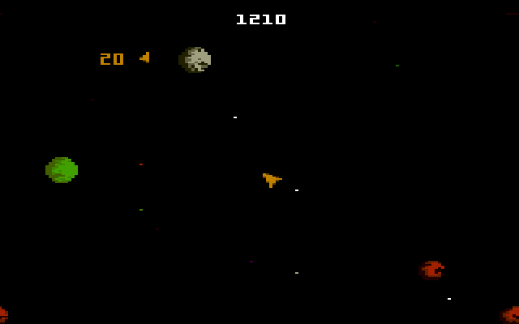
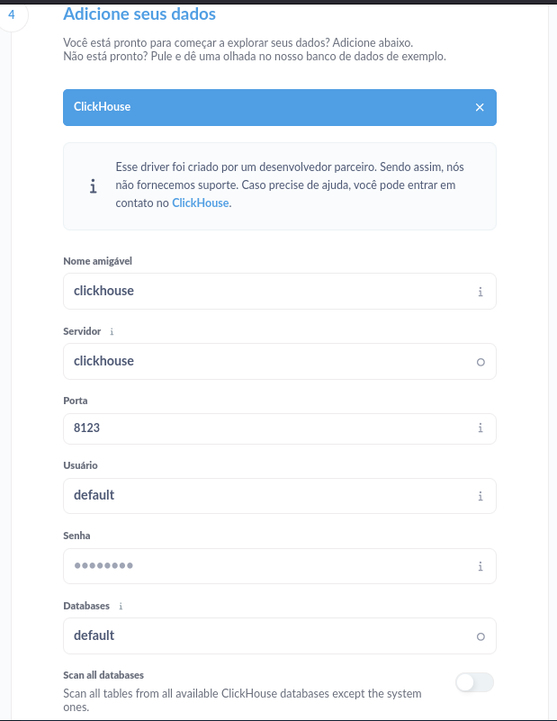

# Asteroids

## Estrutura do Projeto

Este projeto foi divido em duas partes:

- A 1ª Parte tem como objetivo recriar o jogo asteroids e conecta-lo a um banco de dados PostgreSQL;

- A 2ª Parte é construir um sistema de [ETL](https://pt.wikipedia.org/wiki/Extract,_transform,_load) com as infoormações coletadas através do jogo.

## Tecnologias:
- [Python](https://www.python.org/);
- [Docker](https://www.docker.com/products/docker-hub/);
- [Docker Compose](https://docs.docker.com/compose/);
- [PostgreSQL](https://www.postgresql.org/);
- [Airbyte](https://airbyte.com/);
- [ClickHouse](https://clickhouse.com/);
- [Metabase](https://www.metabase.com/).

## 1ª PARTE:

Recrie o clássico jogo [Asteroids](https://en.wikipedia.org/wiki/Asteroids_(video_game)) usando Python para o frontend e backend e PostgreSQL para armazenar as informações. O jogo incluirá funcionalidades básicas como controle da nave espacial, movimento dos asteroides, detecção de colisões, contagem de pontos, conquistas dos jogadores e um histórico de pontuações. Os dados do jogo, como pontuações mais altas, serão armazenados em um banco de dados PostgreSQL.



## Objetivo

O objetivo principal deste projeto é dividido igualmente entre aprender Python e SQL. A ideia é se familiarizar com o ecossistema de bibliotecas, documentação da linguagem e sites conhecidos, tais como a documentação oficial do Python e Pygame, assim como interagir diretamente com um banco de dados PostgreSQL usando SQL através do Python. O jogo apenas serve como uma desculpa legal e prática para alcançar esses objetivos.

## Instruções

### Frontend

- **Python**
    - Implemente a lógica do jogo usando Python com a biblioteca [Pygame](https://www.pygame.org/news). As principais funcionalidades incluem:
        - **Loop:** Crie um loop do jogo para lidar com a renderização e atualização do estado do jogo em uma taxa de quadros especificada.
        - **Colisões:** Implemente um sistema simples de detecção de colisões.
        - **Controle do jogo:** Capture o teclado para controle da nave (impulso, rotação, disparo).
        - **Menu:** Implemente um menu inicial onde os jogadores podem acessar o leaderboard antes de iniciar o jogo.

### Backend

- **PostgreSQL**
    - Crie um schema de banco de dados no PostgreSQL para armazenar as informações do jogo. Tabelas necessárias:
        - **players (id, player_name):** Armazena informações sobre cada jogador.
        - **high_scores (id, player_id, score, date):** Registra as pontuações mais altas individuais, juntamente com o jogador associado e o timestamp.
        - **score_history (id, player_id, score, date):** Registra os históricos de pontuações mais altas para cada jogador.
        - **achievements (id, achievement_name, description):** Armazena diferentes conquistas que os jogadores podem ganhar.
        - **player_achievements (player_id, achievement_id, date_earned):** Registra quais conquistas cada jogador ganhou e quando.
     


## 2ª PARTE:

Nesta última parte do projeto criamos um sistema ETL (Extract, Transform, Load), que é um processo de integração de dados que envolve três etapas principais: extrair dados de várias fontes, transformá-los para atender às necessidades de negócios ou formatos específicos e carregá-los em um sistema de destino, como um data warehouse. O propósito do ETL é consolidar dados dispersos, garantir a qualidade dos dados e facilitar a análise e a tomada de decisões. Para a construção de tal sistema, utilizamos as seguiintes ferramentas:

- **Airbyte**
    - Plataforma de integração de dados
    - Esta ferramenta nos ajuda a conectar o Banco de Dados PostgreSQL ao Banco de Dados ClickHouse


- **ClickHouse**
    - O ClickHouse é um sistema de gerenciamento de banco de dados SQL orientado a colunas e de alto desempenho para processamento analítico online.
    - Utilizamos para receber e tratar os dados que são extraídos do PostgreSQL
    - Ao invés de tabelas criamos views para conseguir lidar com esses dados de forma mais eficaz no próximo passo.
 

- **Metabase**
    - Ferramenta de relatórios e BI que permite criar relatórios e dashboards.
    - Com esta ferramenta analisamos dados como:
        - ***Gráfico de barras***: Jogadores com as maiores pontuações em ordem decrescente.
        - ***Gráfico de dispersão***: Pontuações em diferentes datas.
        - ***Gráfico de barras***: Quantidade de conquistas por jogador.
        - ***Gráfico de barras***: Pontuação média de cada jogador em ordem decrescente.


### Implementação

- **Setup**
    - Toda da estrutura de dados do projeto roda em sistemas dockerizados, para executar o projeto será necessário ter o docker e docker-compose instalados.
    - Passo 1: Clonar o repositório
    ```bash
    git clone https://github.com/DaviPrograme/asteroids.git
    ``` 
    - Passo 2: Iniciar Submodules e criar a venv python
    ```bash
    make init
    ```
    - Passo 3: Acessar a venv
    ```bash
    source ./venv/bin/activate && pip install -r requirements.txt
    ```
    - Passo 4: Inicializar todos os Contêiners
    ```bash
    make
    ```
    - Passo 5: Inicializar o PostgreSQL
    ```bash
    python backend/postgres/backend.py
    ```
    - Passo 6: Criar os conectores no Airbyte(a conexão será manual pela plataforma)
    ```bash
    python services/airbyte/create_connection.py
    ```
    - Passo 7: Criar os conectores no Airbyte(a conexão será manual pela plataforma)
    ```url
    acesse em seu navegador: localhost:8000
    user: airbyte
    password: password
    ```
    ##### Acessando o Airbyte, a tela inicial sera simiilar a tela abaixo. Clique no botão "***Create your first connection***". Caso você tenha seguido os passos até aqui sem nenhum tipo de erro, o Airbyte vai apresentar que já existe um conector para o PostgreSQL e um para o ClickHouse, então é só seleciona-los na ordem que vai ser apresentado e ir seguuindo para o próximo passo.
    

    #### no fim, sua tela deve estar parecida com esta:
    
    
    - Caso tenha DBeaver instalado o clickhouse tera o banco "airbyte_internal"
    

    - Passo 8: Inicializar o ClickHouse. Este script gera as views necessárias para a visualização no Metabase

    ```bash
    python backend/clickhouse/clickhouse.py
    ```
    

    - Passo 9: Acessar o Metabase
    ```
    acesse: localhost:3000
    siga os passos iniciais
    em seguida garanta que esta tela tenha os mesmos dados: 
    ```
    

    - Passo 10: Inicializar o Jogo. Isso serve para gerar dados (e se divertir um pouco)
    ```bash
    python frontend/frontend.py
    ```

    ##### Ultimo Passo
    - Montar alguns gráficos no Metabase

