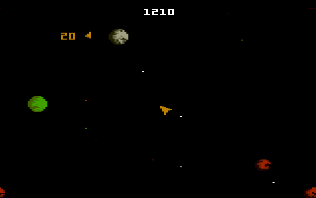

# Asteroids

Recrie o clássico jogo [Asteroids](https://en.wikipedia.org/wiki/Asteroids_(video_game)) usando Python para o frontend e backend e PostgreSQL para armazenar as informações. O jogo incluirá funcionalidades básicas como controle da nave espacial, movimento dos asteroides, detecção de colisões, contagem de pontos, conquistas dos jogadores e um histórico de pontuações. Os dados do jogo, como pontuações mais altas, serão armazenados em um banco de dados PostgreSQL.

## Objetivo

O objetivo principal deste projeto é dividido igualmente entre aprender Python e SQL. A ideia é se familiarizar com o ecossistema de bibliotecas, documentação da linguagem e sites conhecidos, tais como a documentação oficial do Python e Pygame, assim como interagir diretamente com um banco de dados PostgreSQL usando SQL através do Python. O jogo apenas serve como uma desculpa legal e prática para alcançar esses objetivos.

## Instruções

### Frontend

- **Python**
    - Implemente a lógica do jogo usando Python com a biblioteca [Pygame](https://www.pygame.org/news). As principais funcionalidades incluem:
        - **Loop:** Crie um loop do jogo para lidar com a renderização e atualização do estado do jogo em uma taxa de quadros especificada.
        - **Colisões:** Implemente um sistema simples de detecção de colisões.
        - **Controle do jogo:** Capture o teclado para controle da nave (impulso, rotação, disparo).
        - **Menu:** Implemente um menu inicial onde os jogadores podem acessar o leaderboard antes de iniciar o jogo.

### Backend

- **Banco de Dados**
    - Use `psycopg2` para gerenciar a interação com o banco de dados PostgreSQL. Garanta que as pontuações e outras informações do jogo sejam armazenadas e recuperadas de forma eficiente.

### Banco de dados

- **PostgreSQL**
    - Crie um schema de banco de dados no PostgreSQL para armazenar as informações do jogo. Tabelas necessárias:
        - **players (id, player_name):** Armazena informações sobre cada jogador.
        - **high_scores (id, player_id, score, date):** Registra as pontuações mais altas individuais, juntamente com o jogador associado e o timestamp.
        - **score_history (id, player_id, score, date):** Registra os históricos de pontuações mais altas para cada jogador.
        - **achievements (id, achievement_name, description):** Armazena diferentes conquistas que os jogadores podem ganhar.
        - **player_achievements (player_id, achievement_id, date_earned):** Registra quais conquistas cada jogador ganhou e quando.

### Implantação

- **Setup**
    - Configure uma maneira fácil de executar o projeto localmente com os scripts necessários para configurar o projeto.

### Adicionais

- **Segurança:** Garanta que todos os inputs do jogador sejam sanitizados e seguros.
- **Flexibilidade:** Você pode precisar tomar decisões sobre features/detalhes adicionais, componentes da UI ou otimizações necessárias para melhorar o jogo.
- **Persistência de dados:** Garanta que as pontuações e os dados do jogo sejam armazenados de forma persistente no PostgreSQL e possam ser recuperados de maneira eficiente.
